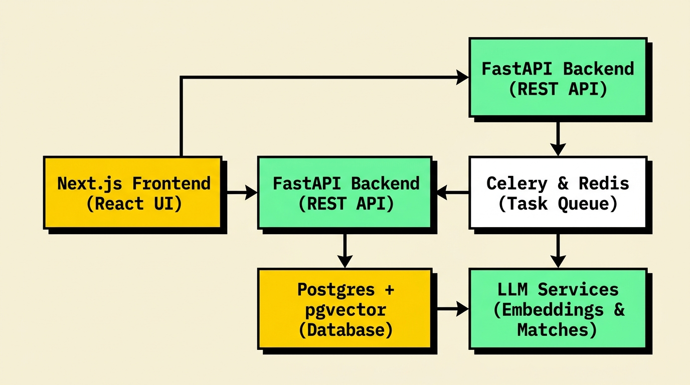

# Job Scout: Neural Job Discovery & Tracking

[](https://nextjs.org/)
[](https://fastapi.tiangolo.com/)
[](https://www.postgresql.org/)
[](https://www.docker.com/)
[](https://docs.celeryq.dev/)
[](LICENSE)
[](https://huggingface.co/unsloth/Llama-3.2-3B-Instruct)

---

## About

Job Scout was built to solve a real problem: the modern job hunt is noisy, repetitive, and privacy-invasive. Most AI job tools send your resume to third-party APIs (like OpenAI or Anthropic) and lock insights behind paywalls.

This project takes a fundamentally different approach:

- **100% Local Execution:** Your resume, your vector embeddings, and your generated cover letters are all processed on your own hardware. Absolutely no data leaves your machine.
- **Context-Aware AI:** The retrieval-augmented generation (RAG) pipeline reads your active resume semantically, finds the most relevant parts of your experience for each job, and injects them into the LLM prompt. The output sounds exactly like you, rather than a generic template.
- **Built for Daily Use:** From a Kanban board to track applications, to a Market Radar that maps your skills against live postings, to a robust admin dashboard for tracking background indexing. Job Scout is designed as a daily driver.
- **Highly Configurable:** The model, embedding dimensions, scraper targets, and hardware device (CPU/GPU) can be adjusted dynamically via the in-app configuration panel.

> Built with Next.js 15, FastAPI, PostgreSQL + pgvector, Celery, Playwright, and Llama-3.2-3B-Instruct.

---

## Visual Showcase

| Warm Cream Light Theme | Kanban Board Tracker |
|:---:|:---:|
|  |  |

| Resume Vault | Neural Candidate Profile |
|:---:|:---:|
|  |  |

| AI Copilot (Dark Mode) | Market Radar & Skills |
|:---:|:---:|
|  |  |

| Config & Diagnostics | Exit & Shutdown |
|:---:|:---:|
|  |  |

---

## Key Features

- **Neural Matching (Semantic Search):** Generates high-dimensional vector embeddings of your resume using `all-MiniLM-L6-v2`. It leverages PostgreSQL's `pgvector` extension to rank and match jobs by semantic relevance instead of rigid keyword matching.
- **AI Copilot (Resume & Cover Letters):** A full-screen AI Copilot powered by `Llama-3.2-3B-Instruct`. Select any scraped job listing (or paste a custom description) and receive a tailored resume or personalized cover letter generated entirely on-device.
- **Dual-Track RAG Pipeline:** Before generating, the system retrieves the top 6 most relevant bullets from your resume and the top 3 similar market job listings from the database. This context grounds the LLM outputs in your real experience and current market language.
- **AI Generation Cache:** A SHA-256 hashed cache layer backed by PostgreSQL ensures identical requests return instantly. The cache can be managed from the Config panel.
- **Dynamic Hardware Selector:** Switch AI inference between CPU and CUDA (GPU) at runtime via the Config panel—no restart required.
- **Resume Vault:** Store, activate, and manage multiple resume profiles. Switching active resumes instantly recalculates all matching scores across the platform.
- **Admin Dashboard & Telemetry:** Access `/admin` (protected by a custom secure key) to view real-time system metrics, RAM/CPU usage, Celery worker status, and an interactive Recharts graph tracking indexing velocity.
- **Automated Scraping Pipeline:** Celery background tasks trigger Playwright scrapers in parallel to pull fresh postings from LinkedIn, Indeed, Naukri, RemoteOK, and We Work Remotely.
- **Kanban Board:** Move jobs through a visual application pipeline (Interested -> Applied -> Interviewing -> Offer).
- **Market Radar:** Highlights target roles, preferred locations, and matches your skill set against real-time market demands using interactive radar charts.
- **Neo-Brutalist Theme:** A stark, vibrant design toggling between a warm-cream Light mode and a deep Midnight-Indigo Dark mode with a glowing violet grid paper effect.
- **System Control:** Shut down or restart the entire stack directly from the UI.
- **Enterprise-Grade Local Security:** Strict file upload validation, parameterized SQL queries to prevent injection, dependency pinning for reproducible builds, and custom authentication headers for system endpoints.

---

## System Architecture



- **Embeddings Model:** `all-MiniLM-L6-v2` (384-dimensional vector padded to 768d, running locally).
- **Text Generator Model:** `unsloth/Llama-3.2-3B-Instruct` (Local inference on CPU/CUDA).
- **Vector Store:** PostgreSQL with the `pgvector` extension and an HNSW index for O(log n) approximate nearest-neighbor search.
- **Generation Strategy:** Deterministic greedy decoding (`do_sample=False`) with `repetition_penalty=1.2` to prevent hallucinations and ensure reproducible outputs.

---

## Getting Started

### Prerequisites

Ensure you have the following installed on your machine:
- [Docker & Docker Compose](https://docs.docker.com/get-docker/)
- [Node.js (v18+) & npm](https://nodejs.org/)
- [Python (v3.10+)](https://www.python.org/)

---

### Quick Start: One-Command Boot (Recommended)

Job Scout comes with a self-bootstrapping launcher. Run the script from the project root:

**For Linux/macOS:**
```bash
chmod +x run.sh
./run.sh
```

**For Windows (PowerShell):**
```powershell
.\run.ps1
```

*(Note: If you encounter an `ExecutionPolicy` error on Windows, bypass it temporarily by running: `powershell -ExecutionPolicy Bypass -File .\run.ps1`)*

**The startup script will automatically:**
1. Verify Docker is running.
2. Create local configuration files (`.env`).
3. Initialize isolated Python virtual environments.
4. Install all required dependencies for the backend, frontend, and scrapers.
5. Pre-download local AI models.
6. Install Playwright browser dependencies.
7. Launch PostgreSQL, Redis, FastAPI, Celery Workers, and the Next.js Server.

To shut down all services cleanly, press `Ctrl+C` in your terminal.

---

### Setup via Docker Compose (100% Containerized)

You can run the entire stack containerized using Docker Compose:

```bash
# 1. Download local models to prevent startup timeouts
python3 -m venv setup_venv && source setup_venv/bin/activate
pip install sentence-transformers transformers torch
python scripts/download_models.py
deactivate && rm -rf setup_venv

# 2. Start all services
docker compose up --build
```

---

## Project Structure

```text
├── backend/                  # FastAPI Backend API
│   ├── app/
│   │   ├── core/             # DB setup & Configuration
│   │   ├── models/           # SQLAlchemy models with pgvector
│   │   ├── services/         # Embedding generation & LLM parsing
│   │   └── main.py           # API endpoints
│   ├── requirements.txt      # Pinned Python dependencies
│   └── Dockerfile            # Backend Docker build instructions
├── frontend/                 # Next.js Frontend App
│   ├── src/
│   │   ├── components/       # UI elements (JobCard, Kanban, Admin)
│   │   └── app/              # App router (globals, layouts)
│   └── package.json          # Frontend dependencies
├── scraper/                  # Scrapers & Task Engine
│   ├── celery_app.py         # Celery task configuration
│   ├── tasks.py              # Background scraping workflows
│   ├── linkedin_scraper.py   # Playwright scraper module
│   └── Dockerfile            # Scraper Docker build instructions
├── scripts/                  # Helper Utilities
├── docker-compose.yml        # Orchestration file
└── run.sh / run.ps1          # One-click bootstrap scripts
```

---

## Security & Privacy Notice

- **Data Protection:** Job Scout preserves candidate data privacy. Your resume text, contact parameters, and application notes never exit your machine.
- **SQL Injection Prevention:** All database operations utilize parameterized queries, entirely preventing SQL injection attacks.
- **Upload Validation:** Strict MIME-type checking and unique file naming conventions protect the system from malicious uploads and path traversal.
- **Secrets Management:** The local `.env` configuration ensures passwords and admin keys are never committed to version control.

---

## License

This project is licensed under the MIT License - see the [LICENSE](LICENSE) file for details.

*Disclaimer: Job Scout scrapers are intended for personal use and education. Please respect the Terms of Service of the platforms being queried.*
