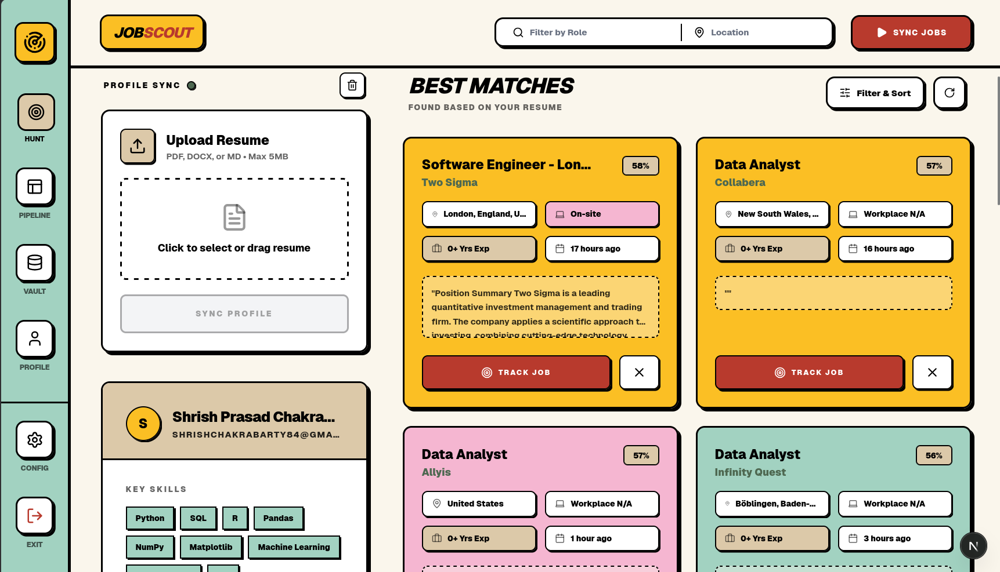
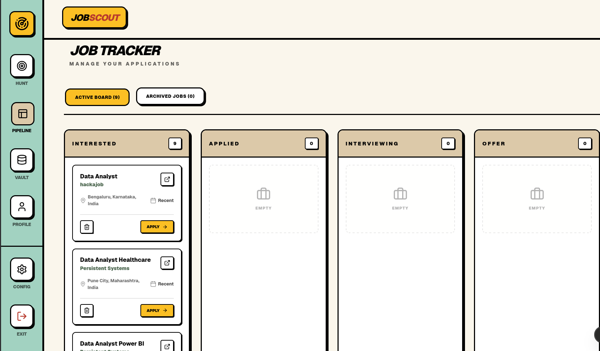
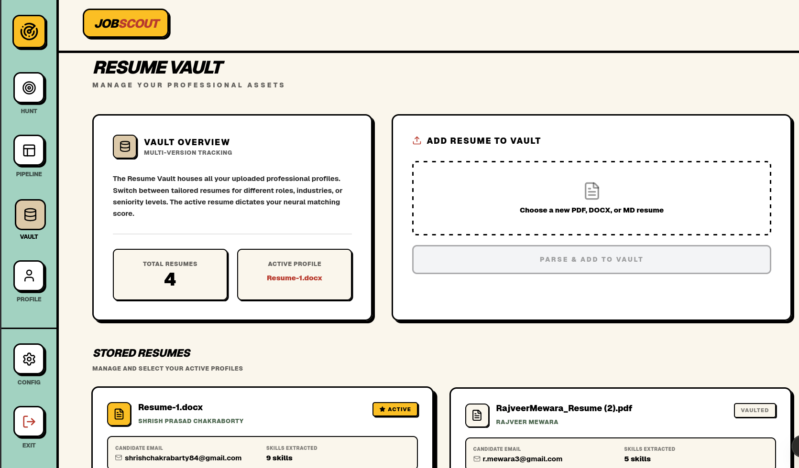
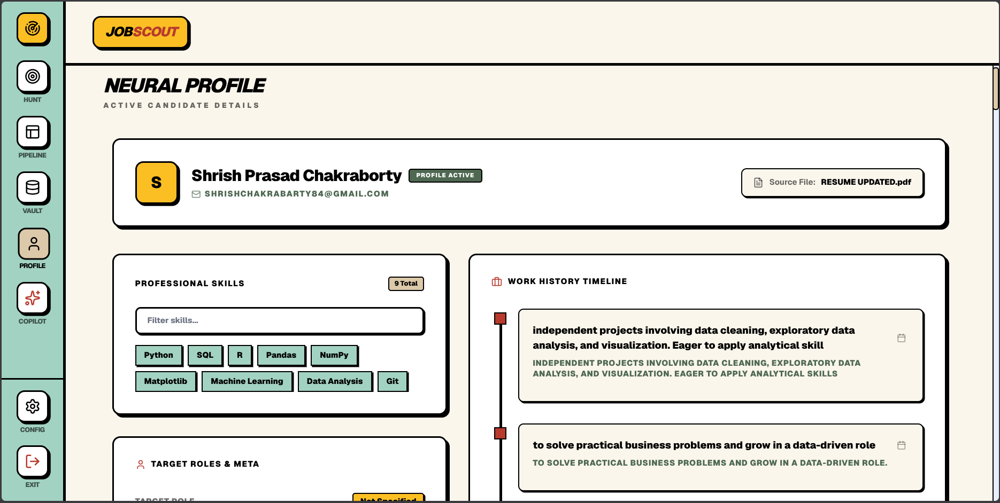
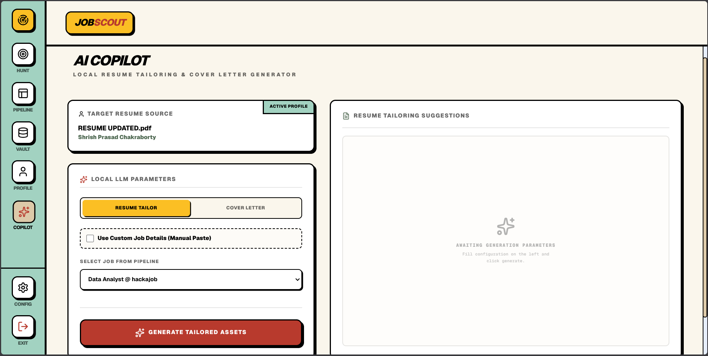
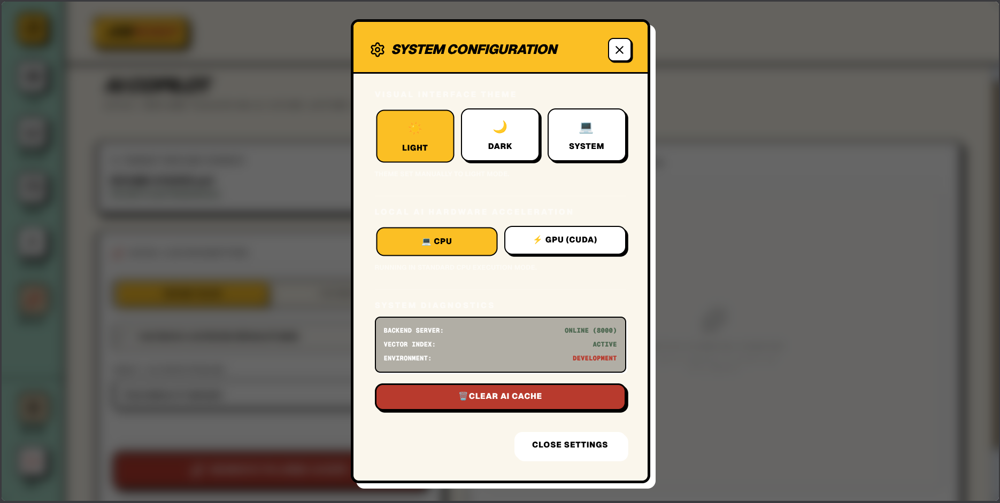
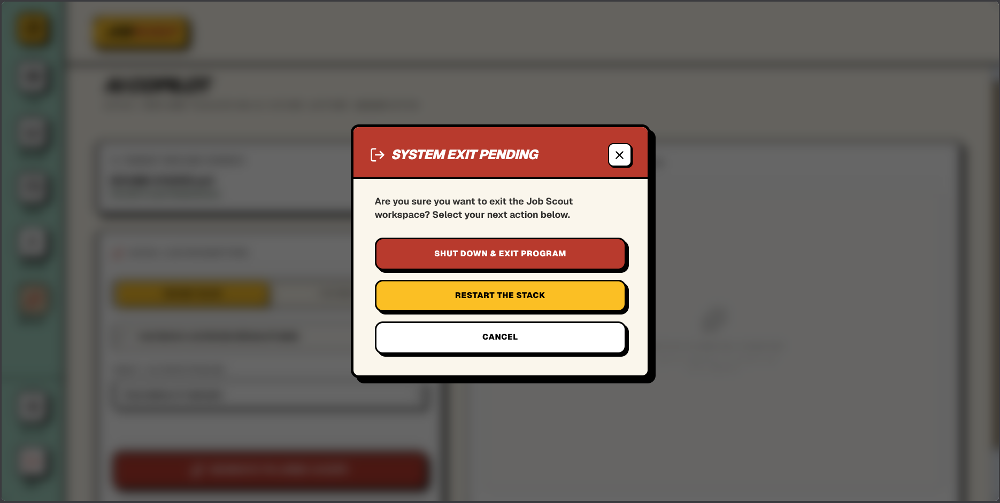
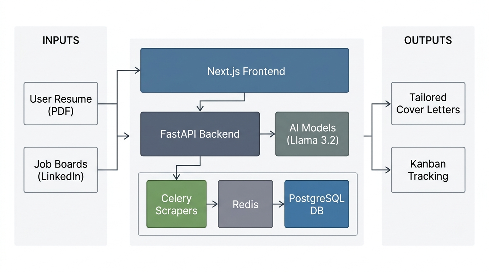

# Job Scout: Neural Job Discovery & Tracking

[](https://nextjs.org/)
[](https://fastapi.tiangolo.com/)
[](https://www.postgresql.org/)
[](https://www.docker.com/)
[](https://docs.celeryq.dev/)
[](LICENSE)
[](https://huggingface.co/unsloth/Llama-3.2-3B-Instruct)

---

## 🎯 About

Job Scout is a local-first, privacy-focused AI job intelligence platform that automates discovery, semantic candidate matching, and application preparation.

- **🔒 100% Local Execution:** Your resume, vector embeddings, and generated cover letters are processed exclusively on your machine. Absolutely no personal data leaves your hardware.
- **🧠 Context-Aware AI (Dual-Track RAG):** The retrieval-augmented generation pipeline reads your active resume semantically, extracts your most relevant experience for each position, and grounds generation in real market requirements.
- **📄 Direct PDF & DOCX Document Export:** Export tailored resumes and cover letters directly to styled PDFs (vector typography with `PyMuPDF`) or Word documents (`python-docx`).
- **⚡ Asynchronous Celery Queue:** Background scrapers query LinkedIn, Indeed, Naukri, RemoteOK, and We Work Remotely with real-time UI telemetry and task status polling.
- **📊 Interactive Market Radar:** Visualize how your skills map against live industry demand through dynamic SVG radar charts.

---

## 📸 Visual Showcase

| Warm Cream Light Theme | Kanban Board Tracker |
|:---:|:---:|
|  |  |

| Resume Vault | Neural Candidate Profile |
|:---:|:---:|
|  |  |

| AI Copilot | Market Radar & Skills |
|:---:|:---:|
|  |  |

| System Config & Telemetry | Exit & Lifecycle Control |
|:---:|:---:|
|  |  |

---

## 🚀 Key Features

- **⚡ Hybrid Neural Matching:** Vector cosine similarity using `all-MiniLM-L6-v2` with PostgreSQL `pgvector` HNSW indexing coupled with title/skill keyword weighting.
- **📄 PDF & DOCX Export Engine:** Download generated resumes and cover letters with publication-grade formatting, margins, and custom typography.
- **✨ AI Copilot:** Instant tailoring for scraped listings or pasted descriptions powered by `Llama-3.2-3B-Instruct`.
- **🗄️ Multi-Resume Vault:** Upload, manage, and toggle active resume identities on the fly.
- **🛡️ Admin Telemetry Dashboard (`/admin`):** Hardware utilization monitoring, Celery worker status, cache management, and indexing velocity charts.
- **🔄 Asynchronous Scraper Pipeline:** Multi-source parallel scrapers (LinkedIn, Indeed, Naukri, RemoteOK, We Work Remotely) with live progress feedback.
- **📋 Kanban Application Pipeline:** Drag-and-drop workflow tracking (*Interested*, *Applied*, *Interviewing*, *Offered*, *Rejected*).
- **🎨 Neo-Brutalist Interface:** High-contrast retro-modern UI with WCAG-compliant color contrast and fluid responsive components.

---

## 🛠️ Architecture



- **Vector Search:** HNSW index on `jobs.embedding` for sub-millisecond similarity lookups.
- **Embedding Model:** `all-MiniLM-L6-v2` (384-dimensional vector, cached locally).
- **LLM Generator:** `unsloth/Llama-3.2-3B-Instruct` (Supports CPU, CUDA GPU, and Demo modes).
- **Queue & Results:** Redis broker (`localhost:6380`) with Celery prefork workers.
- **Backend API:** FastAPI on `localhost:8001` with automated database migrations.
- **Frontend:** Next.js 16 on `localhost:3000`.

---

## 🏁 Quick Start

### One-Command Launch (Recommended)

**Linux / macOS:**
```bash
chmod +x run.sh
./run.sh
```

**Windows (PowerShell):**
```powershell
.\run.ps1
```

### Docker Compose

```bash
docker compose up -d --build
```

### Service Map

- **Web App:** [http://localhost:3000](http://localhost:3000)
- **Admin Panel:** [http://localhost:3000/admin](http://localhost:3000/admin)
- **Backend API Docs:** [http://localhost:8001/docs](http://localhost:8001/docs)
- **Database (PostgreSQL):** `localhost:5435`
- **Redis Queue:** `localhost:6380`

---

## 📁 Project Structure

```text
├── backend/                  # FastAPI Backend API
│   ├── app/
│   │   ├── core/             # DB connection, config, & pooling
│   │   ├── models/           # SQLAlchemy models with pgvector
│   │   ├── services/         # Embedding, RAG pipeline, export engine
│   │   └── main.py           # REST endpoints & Celery task dispatcher
│   ├── requirements.txt      # Pinned Python dependencies
│   └── Dockerfile            # Hardened container definition
├── frontend/                 # Next.js 16 Web Application
│   ├── src/
│   │   ├── components/ui/    # Neo-Brutalist UI components & views
│   │   └── app/              # Next.js App Router (pages & admin)
│   ├── package.json          # Node dependencies
│   └── Dockerfile            # Frontend container definition
├── scraper/                  # Asynchronous Scraping Engine
│   ├── celery_app.py         # Celery task configuration
│   ├── tasks.py              # Parallel extraction & embedding tasks
│   ├── remote_scrapers.py    # RemoteOK & We Work Remotely scrapers
│   ├── linkedin_scraper.py   # Playwright LinkedIn scraper
│   ├── indeed_scraper.py     # Playwright Indeed scraper
│   └── Dockerfile            # Scraper worker definition
├── project-docx/             # Project documentation artifacts
├── docker-compose.yml        # Orchestration definition
└── run.sh / run.ps1          # One-click bootstrap scripts
```

---

## 📜 License

This project is licensed under the MIT License. See [LICENSE](LICENSE) for details.
