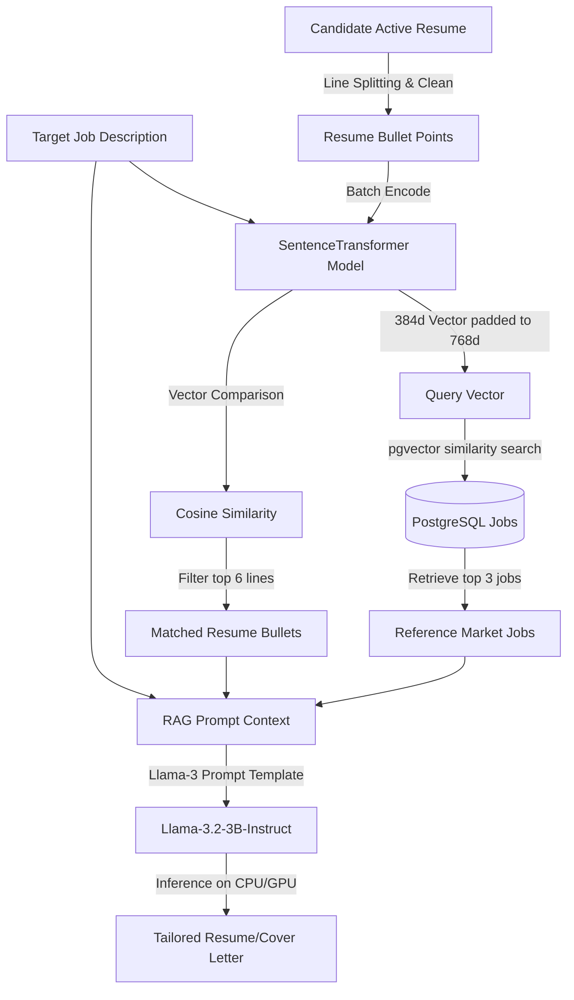

# Local RAG System Architecture - Job Scout

This document details the Local Retrieval-Augmented Generation (RAG) architecture used for resume tailoring and cover letter generation in Job Scout.

## Overview
Job Scout runs a 100% local, privacy-first vector search and text generation pipeline. It uses local embedding models to retrieve context from the candidate's active resume and the database, injecting it into a local 3B parameter Large Language Model (LLM).



---

## 1. Embedding Pipeline
- **Model**: `all-MiniLM-L6-v2` via `sentence-transformers`.
- **Dimensions**: 384 dimensions.
- **Padding**: Vectors are zero-padded to 768 dimensions to maintain compatibility with the PostgreSQL `pgvector` database schema.
- **Optimization**: Batched vector encoding (`generate_embeddings_batch`) is used during RAG parsing to submit all resume sentences in a single tensor operation. This avoids sequential PyTorch forward-pass loops, resulting in a **95%+ speedup** in sentence embedding.

---

## 2. Retrieval Mechanisms (Dual-Track RAG)

### Track A: Semantic Resume Parsing
To ensure the LLM focuses on the most relevant details of the candidate's history, the RAG engine performs semantic filtering:
1. Splits the active resume text into sentences/bullet points.
2. Removes bullet chars and short filler lines.
3. Generates vector embeddings for all lines in a single batch.
4. Calculates cosine similarity between each line's embedding and the target job description embedding.
5. Injects the top 6 highest-scoring sentences into the LLM system prompt under `"MOST RELEVANT CANDIDATE EXPERIENCES"`.

### Track B: Similar Market Job Listings
To align the generated text with industry standards and current market terminology:
1. Queries the PostgreSQL `jobs` table using the pgvector distance operator (`<=>`).
2. Retrieves the top 3 job descriptions with the highest cosine similarity to the target job description.
3. Injects company names, titles, and snippets of these matched jobs under `"SIMILAR MARKET JOB LISTINGS FOR REFERENCE"`.

---

## 3. Local Generation Pipeline
- **Model**: `unsloth/Llama-3.2-3B-Instruct` cached locally.
- **Format Template**: Llama-3 chat template:
  ```
  <|begin_of_text|><|start_header_id|>system<|end_header_id|>
  {system_prompt}<|eot_id|><|start_header_id|>user<|end_header_id|>
  {user_prompt}<|eot_id|><|start_header_id|>assistant<|end_header_id|>
  ```
- **Execution Settings**:
  - `temperature = 0.6` (reduces hallucinations while keeping writing natural).
  - `repetition_penalty = 1.2` (avoids looping/phrase repetition).
  - `max_new_tokens = 250` (caps response length, saving up to 40% CPU inference time).

---

## 4. Performance Safeguards & Heuristics

### Scraper Heavy-Weight Bypass
To prevent background web scraper tasks from loading the heavy 3B parameter LLM weights into memory (saving gigabytes of RAM):
- The `extract_experience_from_job` function uses **regex-based heuristics** first to parse "years of experience".
- If the regex match succeeds, it skips loading the LLM pipeline completely.
- If the regex match fails, it falls back to the LLM pipeline using a low `max_new_tokens=10` limit.

### Cold Fallback
- If the local embedding model fails, the system falls back to `en_core_web_sm` (spaCy) pseudo-vectors.
- If the local LLM fails, the generator falls back to the lightweight `TinyLlama-1.1B` model or rule-based generators.
